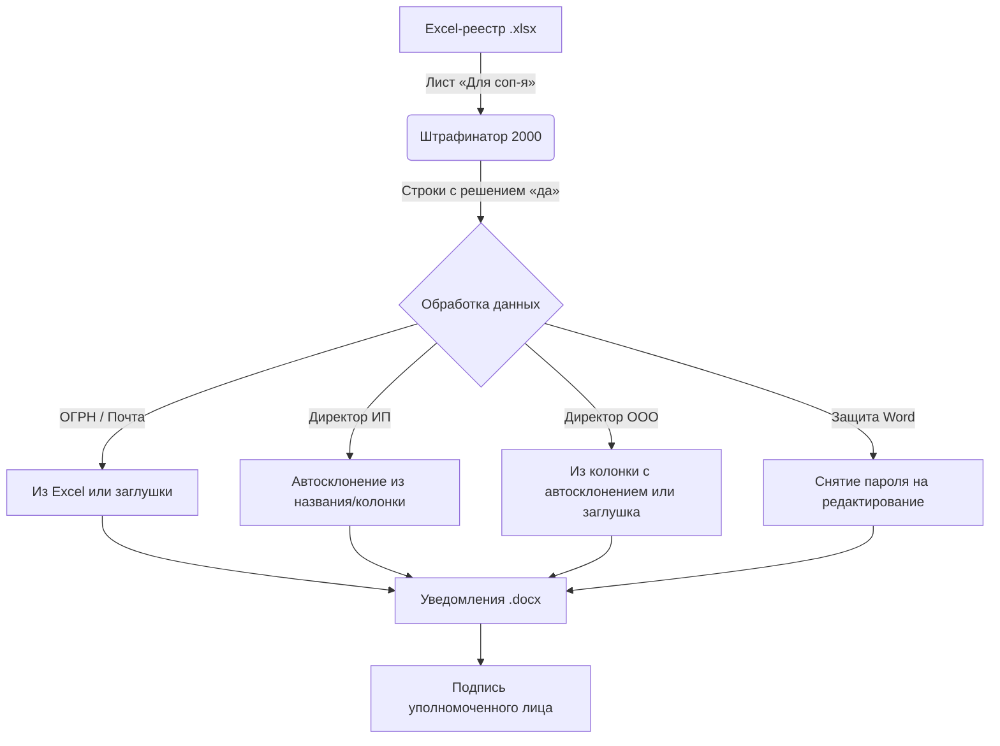

# Штрафинатор 2000

Программа разработана для автоматизации процессов в компании **CloudPayments**. Предназначена для автоматического создания уведомлений об удержании штрафов (.docx) из общего Excel-реестра (.xlsx).

## Схема работы



## Как пользоваться

1. Выберите Excel-файл реестра штрафов (программа ищет лист с названием «Для соп-я» или содержащий «соп» в имени).
2. Выберите папку, куда будут сохранены готовые файлы.
3. Укажите дату уведомления и имя подписанта (если оставить пустым, будет добавлена заглушка для ручного ввода).
4. Нажмите кнопку **«Сгенерировать уведомления»**.

## Логика работы

* **Отбор строк**: Обрабатываются только те строки, у которых в колонке **«Решение»** написано **«да»** (в любом регистре). Остальные строки игнорируются.
* **Дополнительные поля (ОГРН, Почта, Директор)**: Эти колонки необязательны. Если они есть в таблице, данные переносятся. Если их нет, программа не упадет, а просто оставит пустые поля-заглушки в Word.
* **Склонение имен**: Программа автоматически склоняет ФИО директора в дательный падеж (кому: *Иванову Ивану Ивановичу*). Для ИП имя извлекается из названия («ИП Иванов...»), для ООО имя берется из колонки «Директор» (или «Гендир», «Руководитель», «ФИО»).

## Запуск проекта

Для запуска требуется Python 3.10+.

1. Установка зависимостей:
   ```bash
   pip install -r requirements.txt
   ```
2. Запуск приложения:
   ```bash
   python main.py
   ```

## Разработчикам

* **Запуск тестов**:
  ```bash
  python -m pytest tests/
  ```
* **Обновление встроенного шаблона Word**:
  Если шаблон `Уведомление_об_удержании_штрафа_шаблон_v_3.docx` изменился, обновите его base64-представление в коде:
  ```bash
  python -c "import base64; data = open('Уведомление_об_удержании_штрафа_шаблон_v_3.docx', 'rb').read(); open('template_data.py', 'w', encoding='utf-8').write('import base64\nTEMPLATE_B64 = (\n' + '\n'.join(f'    \"{base64.b64encode(data).decode(\"ascii\")[i:i+76]}\"' for i in range(0, len(base64.b64encode(data)), 76)) + '\n)\ndef get_template_bytes() -> bytes:\n    return base64.b64decode(TEMPLATE_B64)\n')"
  ```

## Лицензия

Проект распространяется под лицензией [MIT](LICENSE).
