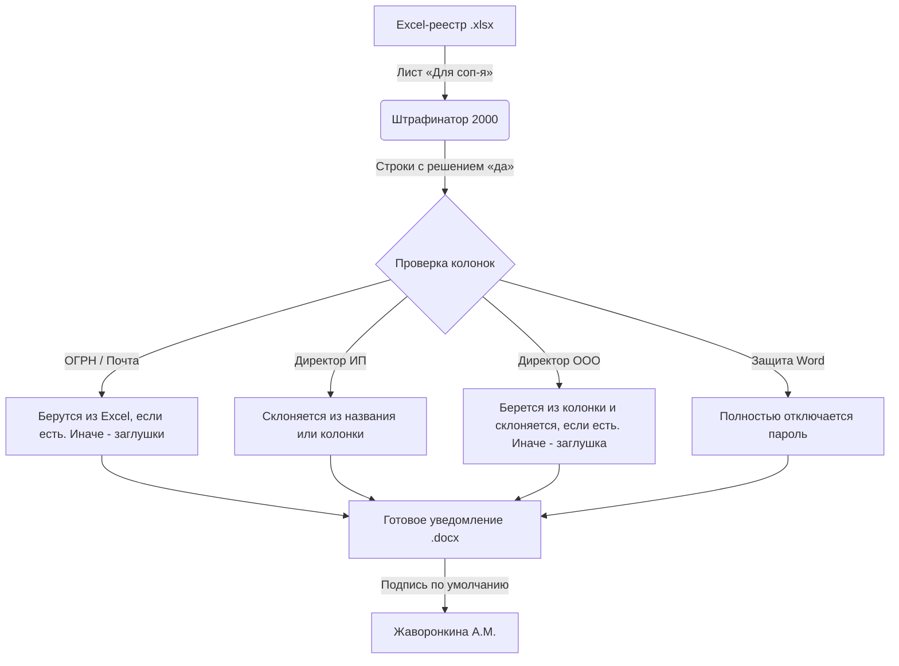

# Штрафинатор 2000 🚀

**Штрафинатор 2000** — это легкое, современное и полностью автономное десктопное приложение для автоматического создания документов об удержании штрафов (.docx) на основе общего Excel-реестра (.xlsx).

---

## 🗺️ Схема работы



---

## ⚡ Ключевые возможности

| Функция | Как это работает | Почему это удобно |
| :--- | :--- | :--- |
| **Автоматизация** | Берет обязательные данные (ИНН, Оборот, Штраф, Решение, % фрода) и дополнительные (ОГРН, Почта, Директор). | Не нужно переносить цифры руками — нет риска опечататься. |
| **Умное склонение** | Извлекает ФИО директора (автоматически для ИП или из колонки для ООО/ИП) и склоняет в дательный падеж (кому: *Завгородневу Григорию Викторовичу*). | Документ сразу выглядит грамотно и профессионально. |
| **Свободный доступ** | Автоматически вырезает из файлов защиту паролем, которую накладывает Word. | Готовые файлы можно сразу дописывать и редактировать. |
| **100% Оффлайн** | Все файлы шаблонов и даже шрифты зашиты прямо в код программы (0 сетевых запросов). | Работает на любом закрытом компьютере без интернета. |
| **Новый подписант** | По умолчанию внизу ставится подпись представителя. | Шаблон обновлен на актуального сотрудника — **Жаворонкина А.М.** |

---

## 🛠️ Установка и запуск

> [!IMPORTANT]
> Для работы приложения на компьютере должен быть установлен **Python версии 3.10 или новее**.

1. **Скачайте зависимости**:
   Откройте терминал/командную строку в папке с программой и выполните:
   ```bash
   pip install -r requirements.txt
   ```
2. **Запустите программу**:
   ```bash
   python main.py
   ```

---

## 📖 Пошаговое руководство

1. В поле **«Excel-реестр штрафов»** нажмите **«Обзор»** и выберите ваш реестр.
   * *Программа ищет лист с названием «Для соп-я» (или содержащий «соп» в имени).*
2. В поле **«Папка для сохранения»** нажмите **«Обзор»** и выберите папку, куда сложить готовые файлы.
3. Выберите нужную **дату уведомления** с помощью выпадающих списков.
4. Нажмите кнопку **«Сгенерировать уведомления»**.
5. По завершении нажмите кнопку **«📁 Открыть папку»** в правом верхнем углу результатов, чтобы сразу перейти к файлам.

---

## 💡 Логика работы (для человека)

> [!NOTE]
> * **Отбор данных**: Программа обрабатывает только те строки из листа **«Для соп-я»**, у которых в колонке **«Решение»** стоит слово **«да»** (в любом регистре). Все остальные строки пропускаются.
> * **Дополнительные колонки (ОГРН, Почта/Email, Директор/Гендир)**: Эти колонки полностью необязательны. Если они есть в Excel-реестре, программа берет данные оттуда. Если их нет, программа спокойно пропускает их без ошибок и предупреждений, создавая файлы со стандартными заглушками для ручного заполнения.
> * **Склонение имен директоров**: ФИО директора автоматически склоняется в дательный падеж (кому: *Иванову Ивану Ивановичу*). Для ИП имя извлекается прямо из названия (например, «ИП Иванов Иван Иванович»), а для ООО или для ручного переопределения у ИП используется колонка **«Директор»** (также подходят названия **«Гендир»**, **«Руководитель»**, **«ФИО»**).

---

## 🔧 Для разработчиков

* **Запуск тестов**:
  ```bash
  python -m pytest tests/
  ```
* **Обновление встроенного шаблона Word**:
  Если вы изменили файл `Уведомление_об_удержании_штрафа_шаблон_v_3.docx`, обновите код встроенного шаблона следующей командой:
  ```bash
  python -c "import base64; data = open('Уведомление_об_удержании_штрафа_шаблон_v_3.docx', 'rb').read(); open('template_data.py', 'w', encoding='utf-8').write('import base64\nTEMPLATE_B64 = (\n' + '\n'.join(f'    \"{base64.b64encode(data).decode(\"ascii\")[i:i+76]}\"' for i in range(0, len(base64.b64encode(data)), 76)) + '\n)\ndef get_template_bytes() -> bytes:\n    return base64.b64decode(TEMPLATE_B64)\n')"
  ```
